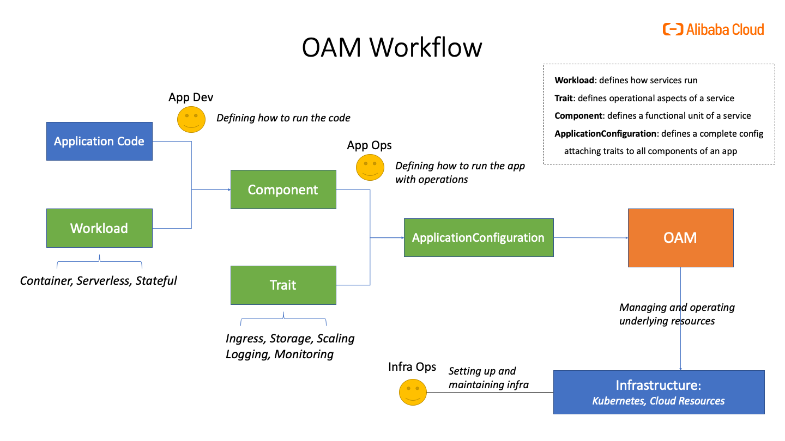

提纲：
- OAM：自包含、关注点分离的云原生应用定义
    - [构建以应用为中心的“Kubernetes”](https://zhuanlan.zhihu.com/p/183857762)
    - OAM 基本概念
        - WorkloadDefinition: [cloneset workload definition](https://github.com/oam-dev/catalog/blob/master/workloads/cloneset/workloadDefinition.yaml)
        - TraitDefinition: [ingress trait definition](https://github.com/oam-dev/catalog/blob/master/traits/ingresstrait/config/oam/trait_definition.yaml)
        - [Component](https://github.com/oam-dev/samples/tree/master/2.ServiceTracker_App/Components)
        - [ApplicationConfiguration](https://github.com/oam-dev/samples/blob/master/2.ServiceTracker_App/ApplicationConfiguration/tracker-app-config-managed.yaml)
            - 自包含：所有服务组件和运维能力都在一个定义里。
            - 结构化：traits attached to components，避免了 label selector 等关联资源的方式，让用户使用更简单，体验也更友好。
				

        - Demo
            - Install [KinD](https://kind.sigs.k8s.io/docs/user/quick-start/#installation)
            - Follow the [README](./oam/README.md) to deploy OAM app
    - 关注点分离:

- CUE configuration language
    - [K8s yaml 管理的窘境](https://blog.cedriccharly.com/post/20191109-the-configuration-complexity-curse/)
        - Templating, Overlay, DSL
        - 简单统一 ⇒ 复杂多养 ⇒ 简单统一
    - [CUE 用法入门](https://cuelang.org/docs/tutorials/tour/intro/)
    - [用 CUE 管理 k8s yaml](https://github.com/cuelang/cue/blob/v0.2.2/doc/tutorial/kubernetes/README.md)
- CUE 跟 OAM 的关系
    - OAM 是服务器端的更高级别抽象，达到以应用为中心。
    - CUE 是客户端工具，为了更高效准确地编写和管理配置文件。
    - OAM 可以通过 CUE 透出更简单易用的模板：CUE ⇒ GitOps/IaC ⇒ OAM
